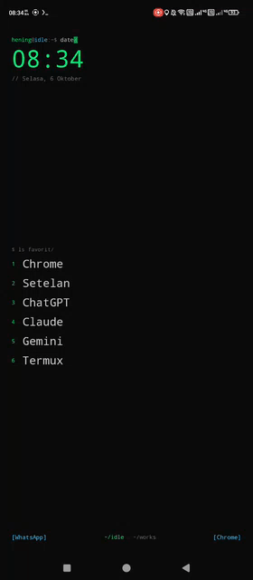

# Hening

  
  
  

Launcher Android minimalis dengan tema terminal untuk programmer. Ide fitur terinspirasi Niagara Launcher dan Olauncher,
ditulis sendiri dari nol dengan Kotlin dan Jetpack Compose. Tanpa ikon di beranda, tanpa iklan, tanpa internet.

## Fitur versi 0.4

**Tampilan dan tema**
- Gaya **Terminal** (prompt `hening@santai:~$ date` dengan kursor berkedip, nomor favorit, komentar `// tanggal`, Ruang sebagai `~/santai`) atau gaya **Minimal**.
- **12 tema warna**: Terminal, Matrix, Dracula, Monokai, Nord, Gruvbox, Solarized, One Dark, Hitam, Putih, **Kustom**, dan **Material You** (mengikuti wallpaper sistem, Android 12 ke atas).
- **Editor tema**: salin warna dari tema yang ada lalu ubah lewat kode hex, **ekspor dan impor** tema sebagai berkas JSON.
- **Font**: monospace, sans, atau **font kustom** (.ttf / .otf pilihanmu, misalnya JetBrains Mono).
- **Gaya jam**: digital, analog, flip, atau bertumpuk.
- **Wallpaper**: polos, 6 gradien, atau foto dari galeri, dengan pengatur peredup.

**Beranda**
- Favorit sebagai teks, urut manual atau otomatis menurut pemakaian, dengan **Ruang** Santai dan Kerja (bisa ganti otomatis).
- **Ringkasan notifikasi** di bawah tiap favorit, **widget media**, dan **agenda** kalender berikutnya (izin opsional).
- **Grup di balik favorit**: geser kanan pada favorit untuk membuka aplikasi yang digrup.
- **Abjad melengkung** di sisi kanan: sentuh untuk melihat aplikasi berawalan huruf itu, geser ke kiri lalu lepas untuk membuka.
- **Waktu layar hari ini** (opsional, perlu Usage access).

**Gestur yang bisa diatur**
Geser atas, bawah, kiri, kanan, ketuk dua kali beranda, tekan lama beranda, dan ketuk dua kali abjad masing-masing bisa dipetakan ke: daftar aplikasi, panel notifikasi, kunci layar, pengaturan, pintasan kiri atau kanan, aplikasi pilihan, atau ganti Ruang.

**Daftar aplikasi**
- Penggeser alfabet dengan getaran halus dan pencarian instan.
- **Perintah terminal** di kolom cari: `g kata` (cari di web), `2+3*4` (kalkulator), `:baru`, `:sering`, `:waktu`, `:ruang`, `:tema`, `:kunci`, `:set`, `:help`.
- Tekan lama aplikasi: favorit, grup, ganti nama, sembunyikan, **jeda sadar**, **batas harian**, info, copot.

**Jeda sadar dan waktu layar**
Aplikasi yang kamu tandai menampilkan layar "napas dulu" beberapa detik sebelum terbuka, lengkap dengan waktu pemakaian hari ini. Bila batas harian tercapai, jedanya lebih lama. Layar ini tidak pernah memblokir: tombol "Tetap buka" selalu tersedia setelah hitung mundur.

**Cadangan**: seluruh pengaturan bisa disimpan ke satu berkas dan dipulihkan kapan saja.

## Izin opsional
Semua izin di bawah ini bisa dimatikan dan aplikasi tetap berfungsi:
- **Akses notifikasi**: ringkasan notifikasi dan widget media.
- **Aksesibilitas**: hanya untuk mengunci layar.
- **Kalender**: agenda berikutnya.
- **Usage access**: waktu layar dan jeda sadar.

Di Android 13 ke atas, aplikasi di luar Play Store perlu **Izinkan setelan terbatas** lewat Info aplikasi
(titik tiga di pojok kanan atas) sebelum akses notifikasi dan aksesibilitas bisa diaktifkan.

## Cara pakai
1. Pasang APK dari **Releases** atau artifact di tab **Actions**.
2. Tekan Home, pilih **Hening**, lalu **Selalu**.
3. Geser ke atas, tekan lama aplikasi, lalu pilih **Jadikan favorit**.
4. Tekan lama beranda untuk membuka pengaturan.

## Rencana
- Widget dan tumpukan widget.
- Cuaca opsional, mode desktop untuk layar lebar, dan pencarian kontak.

## Build
Push ke GitHub, lalu tab **Actions** membuat `Hening-debug.apk` otomatis.
Untuk rilis: `git tag v0.4 && git push origin v0.4`.

## Lisensi
MIT, lihat `LICENSE`.
