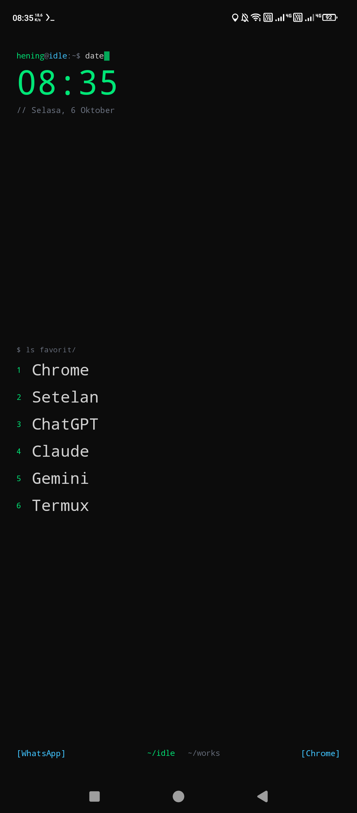
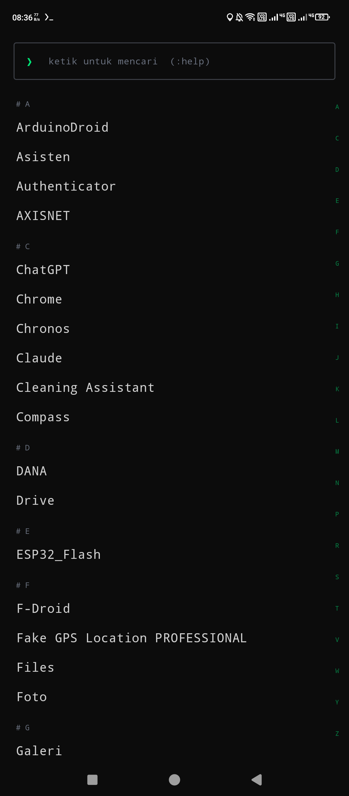

# Hening

  <!-- Menampilkan GIF di tengah -->
  

  <!-- Menampilkan dua PNG bersebelahan di bawah GIF -->
  
  

Launcher Android minimalis dengan tema terminal untuk programmer. Ide fitur terinspirasi Niagara Launcher dan Olauncher,
ditulis sendiri dari nol dengan Kotlin dan Jetpack Compose. Tanpa ikon di beranda, tanpa iklan, tanpa internet.

## Fitur versi 0.2

**Tema**
- Beranda **Monospace** Kursor berkedip, nomor favorit, komentar `// tanggal`, dan Ruang sebagai `~/santai`.
- Font **monospace** di seluruh aplikasi (bisa dimatikan) dan 10 tema warna: Terminal, Matrix, Dracula, Monokai, Nord, Gruvbox, Solarized, One Dark, Hitam, Putih.
- Gaya **Minimal** tersedia untuk tampilan polos.

**Beranda (gaya Niagara)**
- Favorit sebagai teks, urut manual atau otomatis menurut pemakaian.
- **Ringkasan notifikasi** di bawah tiap favorit, dengan jumlah. Tekan lama ringkasan untuk menghapus. Perlu akses notifikasi.
- **Widget media**: judul lagu, pindah lagu, jeda dan putar. Perlu akses notifikasi.
- **Agenda**: acara kalender berikutnya. Perlu izin kalender.
- **Grup di balik favorit**: geser kanan pada favorit untuk membuka aplikasi yang digrup.
- **Ruang** Santai dan Kerja, dengan opsi ganti otomatis (Kerja Sen-Jum 08.00-17.00).

**Gestur**: geser atas = daftar aplikasi, bawah = notifikasi, kanan/kiri = pintasan, ketuk dua kali = kunci layar, tekan lama = pengaturan.

**Daftar aplikasi**
- Penggeser alfabet dengan getaran halus, judul huruf (`# A`), dan pencarian instan.
- **Perintah terminal** di kolom cari: `g kata` cari di web, `2+3*4` kalkulator, `:baru`, `:sering`, `:ruang`, `:tema`, `:kunci`, `:set`, `:help`.
- Tekan lama aplikasi: favorit, pindah atas/bawah, masukkan ke grup, ganti nama, sembunyikan, info, copot.

## Izin opsional
Tiga fitur memakai izin khusus, semuanya bisa dimatikan: akses notifikasi (lencana dan media), aksesibilitas (hanya untuk mengunci layar),
dan kalender. Di Android 13 ke atas, aplikasi di luar Play Store perlu **Izinkan setelan terbatas** lewat Info aplikasi
(titik tiga di pojok kanan atas) sebelum dua izin pertama bisa diaktifkan.

## Cara pakai
1. Pasang APK dari **Releases** atau artifact di tab **Actions**.
2. Tekan Home, pilih **Hening**, lalu **Selalu**.
3. Geser ke atas, tekan lama aplikasi, lalu pilih **Jadikan favorit**.

## Rencana
- Jeda sadar sebelum membuka aplikasi tertentu, batas waktu dan statistik layar.
- Font JetBrains Mono bawaan, wallpaper polos atau gradien, Mode Desktop untuk layar lebar.

## Build
Push ke GitHub, lalu tab **Actions** membuat `Hening-debug.apk` otomatis.
Untuk rilis: `git tag v0.2 && git push origin v0.2`.

## Lisensi
MIT, lihat `LICENSE`.
